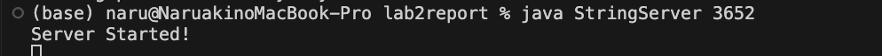
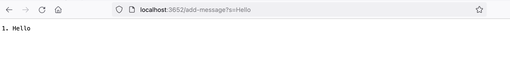
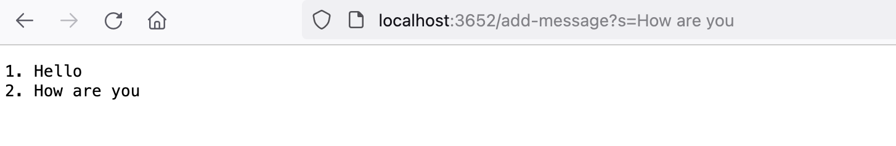
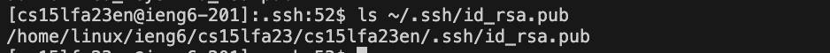
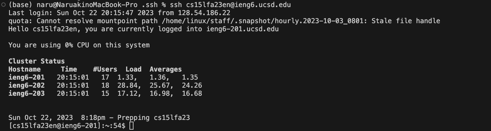

# Lab Report 2 - Servers and SSH Keys (Week 3)

## Part 1

Terminal when I run the server.



Here is my code in StringServer.java

```
import java.io.IOException;
import java.net.URI;

class Handler implements URLHandler {
    // The one bit of state on the server: a number that will be manipulated by
    // various requests.
    int num = 0;
    StringBuilder messages = new StringBuilder();

    public String handleRequest(URI url) {
            if (url.getPath().contains("/add-message")) {
                String[] parameters = url.getQuery().split("=");
                if (parameters[0].equals("s")) {
                    num += 1;
                    messages.append(String.format("%d. %s" + "\n", num, parameters[1]));
                    return messages.toString();
                }
            }
            return "404 Not Found!";
        
    }
}

class StringServer {
    public static void main(String[] args) throws IOException {
        if(args.length == 0){
            System.out.println("Missing port number! Try any number between 1024 to 49151");
            return;
        }

        int port = Integer.parseInt(args[0]);

        Server.start(port, new Handler());
    }
}

```

## Request: /add-message?s=Hello


    Which methods in your code are called?
        handleRequest(URI url)

    What are the relevant arguments to those methods, and the values of any relevant fields of the class?
        Argument to handleRequest: url with a value of new URI("/add-message?s=Hello")
        Relevant field values before method execution:
            num = 0
            messages = (an empty StringBuilder)

    How do the values of any relevant fields of the class change from this specific request?
        After the method execution:
            num becomes 1 (because we incremented it)
            messages now contains the string "1. Hello\n"

## Request: /add-message?s=How are you


    Which methods in your code are called?
        handleRequest(URI URL)

    What are the relevant arguments to those methods, and the values of any relevant fields of the class?
        Argument to handleRequest: url with a value of new URI("/add-message?s=How are you")
        Relevant field values before method execution:
            num = 1 (from the previous request)
            messages = "1. Hello\n"

    How do the values of any relevant fields of the class change from this specific request?
        After the method execution:
            num becomes 2 (because we incremented it)
            messages now contains the string:
            1. Hello
            2. How are you

For both requests, the handleRequest method is called with the respective URI. The num field is incremented with each request, and the messages StringBuilder is appended with the new message.


## Part2
The path to the private key for your SSH key for logging into ieng6 (on your computer or on the home directory of the lab computer)


The path to the public key for your SSH key for logging into ieng6 (within your account on ieng6)


A terminal interaction where you log into ieng6 with your course-specific account without being asked for a password.


## Part 3

I learned how to launch a server and what each component in URL represents such as Domain, Path, Query, and Anchor. I also learned how to create ssh keys, public key and private key to access to remote server.
