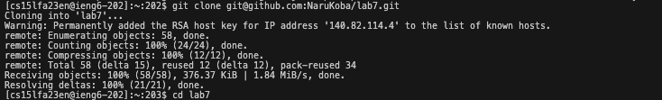
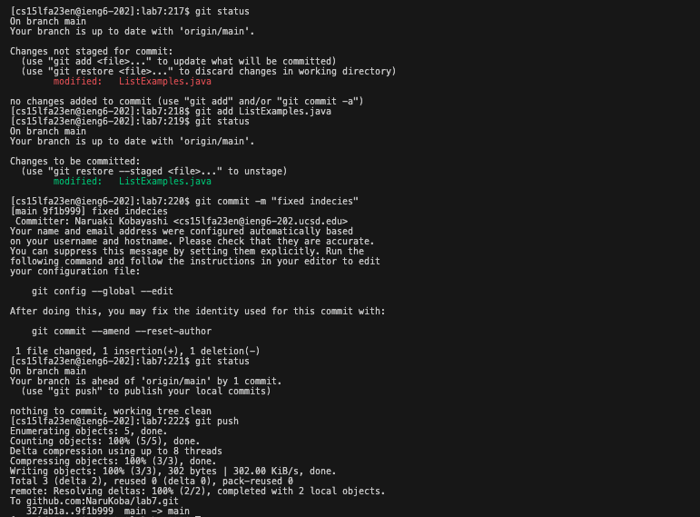

# Lab Report 4 Vim (Week 7)

## Step4: Log into ieng6

### Action
Used SSH to log into the ieng6 server.
### Screenshot
.png)
### Key pressed
```
 $ ssh cs15lfa23en@ieng6.ucsd.edu
```
Typed the SSH command to connect to the server.

## Step 5: Clone Your Repository

### Action
Cloned my repository from GitHub using the SSH URL.
### Screenshot

### Key pressed
```
 $ git clone git@github.com:NaruKoba/lab7.git
```
Entered the git clone command followed by the SSH URL of my repository.

## Step 6: Run the Tests (Demonstrating Failure)

### Action
Executed the tests in my project to show that they failed initially.
### Screenshot
.png)
### Key pressed
```
 $ bash test.sh
```
Typed bash test.sh to compile all of java files and run ListExamplesTests in lab7 directory.

## Step 7: Edit the Code File (ListExamples.java)

### Action
Opened ListExamples.java and corrected the error in the merge method (change index1 to index2 in the final loop).
### Screenshot

### Key pressed
```
$ vim ListExamples.java

```
Inside of ListExamples.java:

Pressed < j > about 40 times to get to the error line and pressed < l > for the cursor to be next to 1. Pressed < i > to change normal mode to insert mode. Pressed < backspace > to delete 1 and typed `< 2 >`. Pressed `<esc>` to return to normal mode. Pressed <:wq> to save changes and quit from vim editor. 


## Step 8: Run the Tests (Demonstrating Success)

### Action
Re-run the tests to demonstrate that my code changes have fixed the issue.
### Screenshot
.png)
### Key pressed
```
$  bash test.sh

```
Similar to step 6, typed bash test.sh to recompile and run the tests.


## Step 9: Commit and Push Changes

### Action
Committed the corrected file to my local Git repository and then pushed the changes to my GitHub account.
### Screenshot

### Key pressed
```
$   git add ListExamples.java
$   git commit -m "fixed indecies"
$   git push
```
Used `git add` to change in my working directory to the staging area. The staging area is like a prep zone for changes before they are committed. 
Used `git commit` to take the staged changes and create a new commit with them in the local repository.
Used `git push` to upload the local repository content to a remote repository. This is how I transfer commits from my local repository to a remote repo (like GitHub).


