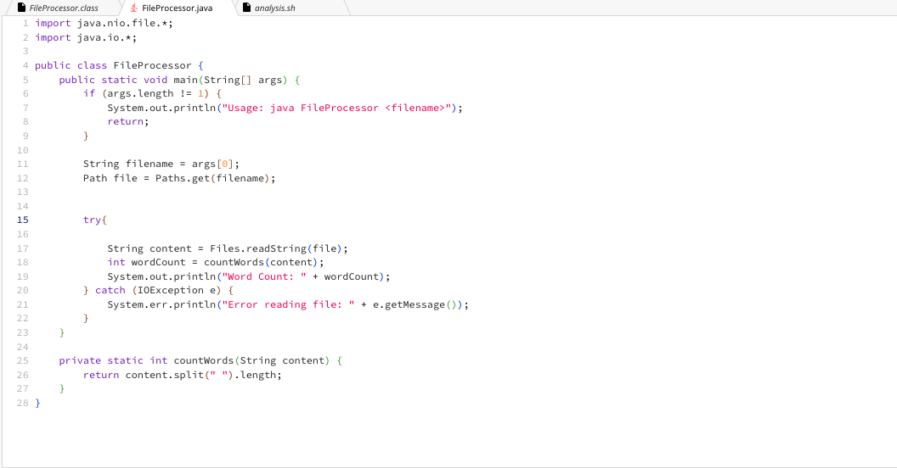
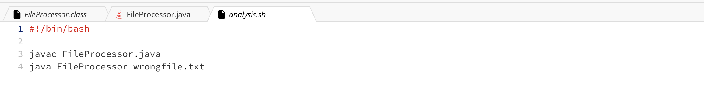
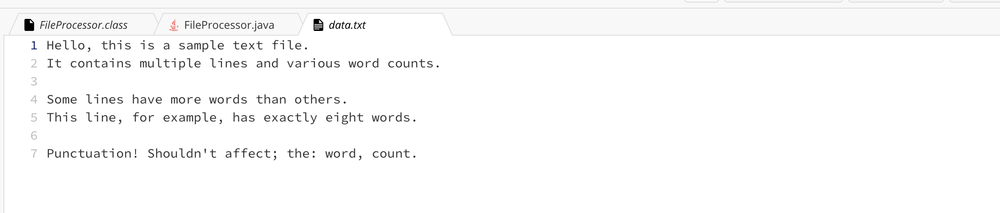

#### The file & directory structure

#### The contents of each file before fixing the bug

#### FileProcessor.java:



Markdown:
```
import java.nio.file.*;
import java.io.*;

public class DataProcessor {
    public static void main(String[] args) {
        if (args.length != 1) {
            System.out.println("Usage: java DataProcessor <filename>");
            return;
        }

        String filename = args[0];
        Path file = Paths.get(filename);

        try {
            String content = Files.readString(file);
            int wordCount = countWords(content);
            System.out.println("Word Count: " + wordCount);
        } catch (IOException e) {
            System.err.println("Error reading file: " + e.getMessage());
        }
    }

    private static int countWords(String content) {
        return content.split(" ").length;
    }
}

```

### analysis.sh


Markdown:
```
#!/bin/bash

javac DataProcessor.java
java DataProcessor wrongfile.txt

```
### data.txt



Markdown:
```
Hello, this is a sample text file. 
It contains multiple lines and various word counts.

Some lines have more words than others.
This line, for example, has exactly eight words.

Punctuation! Shouldn't affect; the: word, count.

```


#### StudentA:
I'm working on a project where I have a Java program that processes data from a file and then outputs results. There's also a Bash script that sets up the environment, compiles the Java code, and runs it with specific parameters. However, I'm encountering some odd behavior:

The Java program doesn't seem to process the file data correctly.

I'm attaching a screenshot of the terminal output after running the Bash script.
Any suggestions on what might be going wrong?


#### TA:
To address the first issue, could you insert a print statement in your Java code to show the file's contents that it's reading? This will help us verify if the file reading part is working correctly.

### StudentA:
After adding a print statement in my Java program, I noticed it's reading an empty file or incorrect content. It seems the issue might be with the file path or how the file is passed to the Java program.


#### TA:
Thanks for the update. Please check the file path in your Bash script and make sure the file exists and is not empty.

### StudentA:
I checked and corrected the file path in the Bash script. Now the Java program reads the correct file, but the processing logic still seems off. The word count is incorrect.

#### TA
It looks like the issue is with the word counting logic in your Java program. Can you share the relevant part of your Java code where you are counting words? We need to ensure it handles cases like multiple spaces, punctuation, etc.

### StudentA:
Here's the Java code snippet for word counting. I can't find what's wrong here. Probably, it has an issue with splitting words?
```
 private static int countWords(String content) {
        return content.split(" ").length;
    }
}
```
#### TA
Yes, The word counting logic doesn't handle multiple spaces or punctuation properly. Update it to split words more accurately, considering these cases.

### StudentA:
I fixed the code like the following:
```
// Updated to correctly count words, considering multiple spaces and punctuation
        return content.trim().split("\\s+").length;
```

Thank you, I got the correct output.


