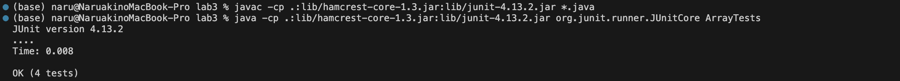
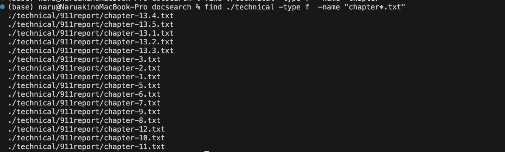
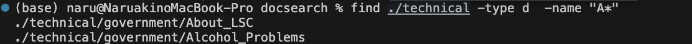
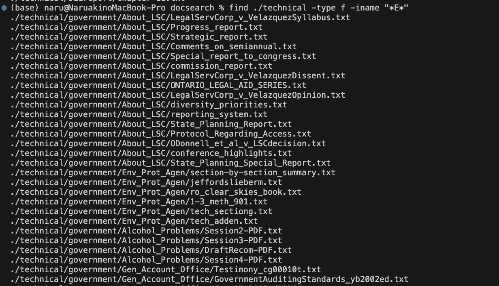
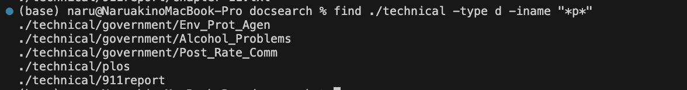
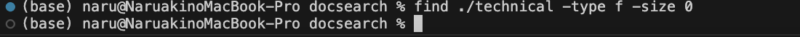
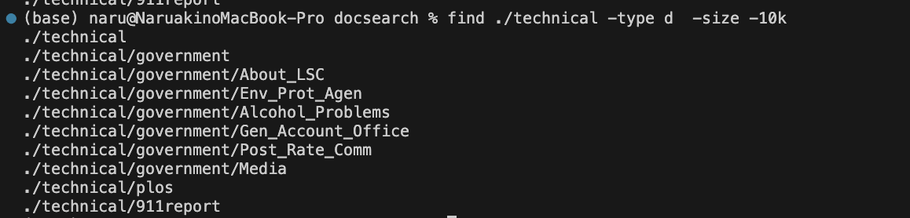
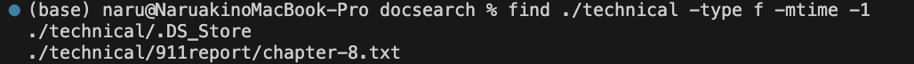
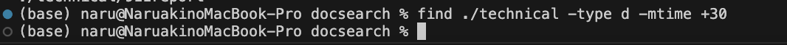

# Lab Report 3  Bugs and Commands (Week 5)

## Part 1

### Here is JUnit test code for failure-inducing input for the buggy program, the averageWithoutLowest; - (1)

```
import static org.junit.Assert.*;
import org.junit.*;

public class ArrayTests {

  @Test
  public void testAverageWithoutLowest_Failure(){
    double[] input = {1.0, 1.0, 3.0, 4.0};
    double result = ArrayExamples.averageWithoutLowest(input);
    assertEquals(3.5, result, 0.0001);
  }
}
```

### Here's the JUnit test code for the non-failure-inducing input for the buggy program, the averageWithoutLowest; - (2)
```
import static org.junit.Assert.*;
import org.junit.*;

public class ArrayTests {
@Test
  public void testAverageWithoutLowerst_Success(){
    double[] input = {2.0, 3.0, 4.0};
    double result = ArrayExamples.averageWithoutLowest(input);
    assertEquals(3.5, result, 0.0001);
}
```

### The symptom
(1);


(2);


### The bug

Here is the buggy averageWithoutLowest method:

```
public class ArrayExamples {

  static double averageWithoutLowest(double[] arr) {
      if(arr.length < 2) { return 0.0; }
      double lowest = arr[0];
      for(double num: arr) {
        if(num < lowest) { lowest = num; }
      }
      double sum = 0;
      for(double num: arr) {
        if(num != lowest) { sum += num; }
      }
      return sum / (arr.length - 1);
    }

}
```

Here is the fixed averageWithoutLowest method:
```
static double averageWithoutLowest(double[] arr) {
    if(arr.length < 2) { return 0.0; }
    double lowest = arr[0];
    int lowestCount = 0;
    for(double num: arr) {
      if(num < lowest) {
        lowest = num;
        lowestCount = 1;
      } else if (num == lowest) {
        lowestCount++;
      }
    }
    double sum = 0;
    for(double num: arr) {
      sum += num;
    }
    return (sum - lowest * lowestCount) / (arr.length - lowestCount);
  }

```
output;


### Why the Fix Addresses the Issue

It checks if the array has fewer than two elements. If so, it returns 0.0 because I can't compute an average without at least two numbers (excluding the lowest).
It initializes lowest with the first element and sets lowestCount to 0.
It iterates through the array to find the lowest number and counts how many times this lowest number appears.
It sums up all the numbers in the array.
It calculates the average by subtracting the total value of the lowest number(s) from the sum and dividing by the number of elements minus the count of the lowest number(s).
This logic ensures that if there are multiple instances of the lowest number, all are excluded from the average calculation.
    
## part 2

### 1. Using the -name option

The -name option allows you to search for files or directories that match a given pattern.
Example 1: Finding a file by name
```
$ find ./technical -type f  -name "chapter*.txt"
```
Output:

This command searches for files (-type f) named chapter*.name within the ./technical directory and its subdirectories. * is used to create a pattern. It's useful for locating all instances of files with a specific name.

Example 2: Finding a directory by name
```
$ find ./technical -type d  -name "A*"  
```
Output:

This command searches for directories (-type d) named A* within the ./technical directory. * is used to create a pattern. This is useful for locating directories with a specific name.

### 2. Using the -iname option

The -iname option is similar to -name, but it is case-insensitive, making it useful for when the exact case of the target files or directories is unknown or mixed.

Example 1: Case-insensitive file search
```
$ find ./technical -type f -iname "*E*"
```
Output:

This command searches for any file with a case-insensitive match to * E *. It's useful when you are unsure of the case used in the file names.

Example 2: Case-insensitive directory search
```
$ find ./technical -type d -iname "*p*"
```
Output:

This command searches for directories with a case-insensitive match to *p*. This is useful for finding directories when the naming convention is not consistently applied.

### 3. Using the -size option

The -size option allows you to find files of a specific size. This can be useful for locating files that are too large or to identify files that are empty.

Example 1: Finding files less than 1 kilobyte
```
$ find ./technical -type f -size -1k 
```
Output:

This command lists files less than 1 kilobyte. It's useful for identifying large files that may be taking up too much space.

Example 2: Finding empty files
```
$ find ./technical -type f -size 0
```
Output:

This command finds files that are exactly 0 bytes in size, which often indicates empty files. This can be useful for cleaning up unnecessary files from a directory.

Example 3: Finding directories less than 10 kilobytes
```
find ./technical -type d  -size -10k
```
Output:

This command finds directories less than 10 kilobytes. This can be useful for cleaning up large-size directories.

### 4. Using the -mtime option
The -mtime option finds files based on their modification time. This can be useful for locating recently modified files or files that haven't been touched in a long time.

Example 1: Finding files modified in the last 24 hours
```
$ find ./technical -type f -mtime -1
```
Output:

This command finds files that have been modified in the last 24 hours. It's useful for reviewing recent changes.

Example 2: Finding directories not modified in the last 30 days
```
$ find ./technical -type d -mtime +30
```
Output:

This command lists directories that have not been modified in the last 30 days. This can be helpful for identifying outdated directories that may no longer be needed.
