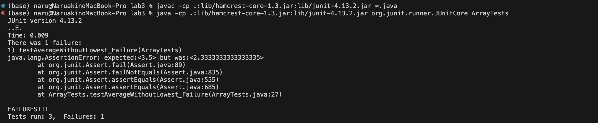
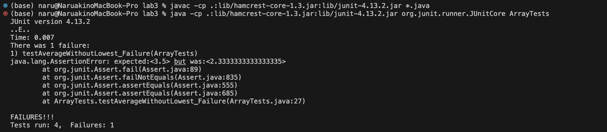

# Lab Report 2 - Servers and SSH Keys (Week 3)

## Part 1

### Here is JUnit test code for failure-inducing input for the buggy program, the averageWithoutLowest; - (1)

```
import static org.junit.Assert.*;
import org.junit.*;

public class ArrayTests {

  @Test
  public void testAverageWithoutLowest_Failure(){
    double[] input = {1.0, 1.0, 3.0, 4.0};
    double result = ArrayExamples.averageWithoutLowest(input);
    assertEquals(3.5, result, 0.0001);
  }
}
```

### Here's the JUnit test code for the non-failure-inducing input for the buggy program, the averageWithoutLowest; - (2)
```
import static org.junit.Assert.*;
import org.junit.*;

public class ArrayTests {
@Test
  public void testAverageWithoutLowerst_Success(){
    double[] input = {2.0, 3.0, 4.0};
    double result = ArrayExamples.averageWithoutLowest(input);
    assertEquals(3.5, result, 0.0001);
}
```

### The symptom
(1);


(2);


### The bug

Here is the buggy averageWithoutLowest method:

```
public class ArrayExamples {
  static double averageWithoutLowest(double[] arr) {
      if(arr.length < 2) { return 0.0; }
      double lowest = arr[0];
      for(double num: arr) {
        if(num < lowest) { lowest = num; }
      }
      double sum = 0;
      for(double num: arr) {
        if(num != lowest) { sum += num; }
      }
      return sum / (arr.length - 1);
    }


}
```

## Request: /add-message?s=Hello


    Which methods in your code are called?
        handleRequest(URI url)

    What are the relevant arguments to those methods, and the values of any relevant fields of the class?
        Argument to handleRequest: url with a value of new URI("/add-message?s=Hello")
        Relevant field values before method execution:
            num = 0
            messages = (an empty StringBuilder)

    How do the values of any relevant fields of the class change from this specific request?
        After the method execution:
            num becomes 1 (because we incremented it)
            messages now contains the string "1. Hello\n"

## Request: /add-message?s=How are you


    Which methods in your code are called?
        handleRequest(URI URL)

    What are the relevant arguments to those methods, and the values of any relevant fields of the class?
        Argument to handleRequest: url with a value of new URI("/add-message?s=How are you")
        Relevant field values before method execution:
            num = 1 (from the previous request)
            messages = "1. Hello\n"

    How do the values of any relevant fields of the class change from this specific request?
        After the method execution:
            num becomes 2 (because we incremented it)
            messages now contains the string:
            1. Hello
            2. How are you

For both requests, the handleRequest method is called with the respective URI. The num field is incremented with each request, and the messages StringBuilder is appended with the new message.


## Part2
The path to the private key for your SSH key for logging into ieng6 (on your computer or on the home directory of the lab computer)


The path to the public key for your SSH key for logging into ieng6 (within your account on ieng6)


A terminal interaction where you log into ieng6 with your course-specific account without being asked for a password.


## Part 3

I learned how to launch a server and what each component in URL represents such as Domain, Path, Query, and Anchor. I also learned how to create ssh keys, public key and private key to access to remote server.

