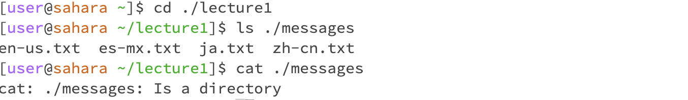

# Practice

For the first line of the command cd, my working directory is ~/lecture1/messages, messages directory. I didn't put any argument for cd command, so space indicated home directory, and my working directory was changed to home directory.  

if cd has no arguments, space refer to homedirectory similar to ~.
