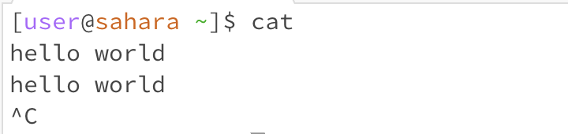

# Practice

## The command with no arguments

For the first command: cd, my working directory was ~/lecture1/messages, messages directory. Cd command changes a working directory to the directory given as an argument to the cd command. I didn't put any argument for cd command, so no argument behaved like home directory and my working directory was changed to home directory. Therefore, the output indicates this is not an error. 

For the second command: ls, my working directory  was ~, home directory. ls command lists all of the files and directories inside the directory referred to as an argument. Since I didn't put any argument for ls command, the command refers to the working directory, home directory in this case. Therefore, it showed lecture1 directory inside the home directory. The output indicates this is not an error.

For the third command: cat, my working directory was ~, home directory. Cat command prints the contents of a file or files whose paths are given as an argument, concatenating the contents if multiple files are provided as arguments to cat command. Since I don't put any argument, it waits for input from standard input, and prints input if I write words in next line. I simply typed ^C to exit from the command without typing any words before ^C. In the following example, I typed "hello world" before I exited and it returned the same message in the next line. Therefore, the output indicates this is not an error. 

## The command with a path to a directory as an argument

For the first command: cd, my working directory was ~, home directory. Cd command changes a working directory to the directory given as an argument to the cd command. I put a path to the subdirectory of home directory by using the relative path ./lecture1. Therefore, my working directory changed to lecture1 directory. The output indicates this is not an error.  

For the second command: ls,  my working directory  was ~/lecture1, lecture1 directory. ls command lists all of the files and directories inside the directory referred to as an argument. In this case, I typed the relative path to messages directory as argument: ./ messages, and it outputted all of the files and directories inside the messages directories. Therefore, the output indicates this is not an error.  

For the third command: cat, my working directory was ~/lecture1, lecture1 directory.  Cat command prints the contents of a file or files whose paths are given as an argument, concatenating the contents if multiple files are provided as arguments to cat command. Since I typed the relative path to a directory not the path to a file, it outputted error message saying "./messages is a directory". Therefore, the output indicates this is an error.   

## The command with a path to a file as an argument.

For the first command: cd, my working directory was ~/lecture1/messages, messages directory. Cd command changes a working directory to the directory given as an argument to the cd command. Since I put the relative path to ja.txt which is not a directory, my working directory was not changed and it showed an error message saying "This is a txt file, not a directory". The output indicates this is an error.  

For the second command: ls,  my working directory  was  ~/lecture1/messages, messages directory. ls command lists all of the files and directories inside the directory referred to as an argument. The ls command can also search only for a specified file, whether the file exits or not. Since I put the relative path to the existing file, ja.txt, as an argument, it outputted ja.txt inside the working directory. Therefore, the output indicates this is not an error.  

For the third command: cat,  my working directory  was  ~/lecture1/messages, messages directory. Cat command prints the contents of a file or files whose path are given as an argument. Since I typed the relative path to the existing file, ja.txt, it outputted the contents of ja.txt, which was "こんにちは　世界". Therefore, the output indicates this is not an error. 
